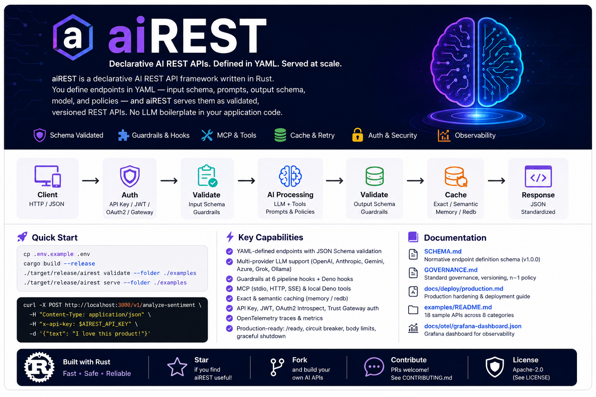
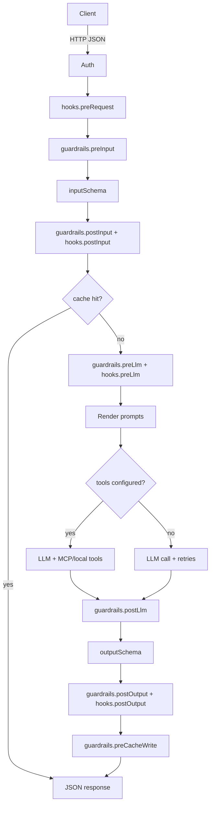

# aiREST

**aiREST** is a declarative AI REST API framework written in Rust. You define endpoints in YAML — input schema, prompts, output schema, model, and policies. aiREST serves them as validated, versioned REST APIs. No LLM boilerplate in your application code.

```text
examples/*.yaml  →  aiREST (Rust/Axum)  →  GET|POST /v1/your-endpoint
```

Clients call ordinary HTTP with JSON bodies. The runtime handles schema validation, prompt rendering, multi-provider LLM routing, structured output enforcement, retries, authentication, and error formatting.

Shipped capabilities:

| Area | YAML / runtime |
|------|----------------|
| **Guardrails** | Built-in + Deno modules at six pipeline hooks |
| **Hooks** | Deno `preRequest` / `postInput` / `preLlm` / `postOutput` with scoped `host.fetch` |
| **Tools** | MCP (stdio, HTTP, SSE) + **local Deno tools**; `tools.allow` required |
| **Cache** | Exact + semantic modes; `memory` / `redb` stores |
| **Auth** | API key, JWT, OAuth2 introspect, trust-gateway |
| **Observability** | OpenTelemetry traces/metrics; per-endpoint `telemetry.enabled` |
| **Production** | `/ready`, circuit breaker, body limits, opt-in graceful shutdown drain |

Details: normative fields in **[SCHEMA.md](SCHEMA.md)** and versioning policy in **[GOVERNANCE.md](GOVERNANCE.md)**.

The normative YAML format for AI REST endpoint definitions is **[SCHEMA.md](SCHEMA.md)** (Definition Schema **1.0.0**). Standard versioning, n−1 compatibility, and change process are defined in **[GOVERNANCE.md](GOVERNANCE.md)**.

## What aiREST Does

Most teams embed LLM calls directly in application code. Prompts scatter across services, outputs are inconsistent, and there is no shared contract for inputs or responses. aiREST inverts that: **AI behavior becomes configuration**.

For each endpoint you declare:

| Concern | YAML field | Runtime responsibility |
|---------|------------|----------------------|
| Request shape | `inputSchema` | Reject invalid JSON before calling the model |
| AI instructions | `systemPrompt`, `userPromptTemplate` | Render Handlebars templates from request data |
| Response contract | `outputSchema` | Parse model JSON and validate structure |
| Model choice | `model` | Route to OpenAI, Anthropic, Gemini, Azure, Grok, or Ollama |
| Safety | `guardrails` | Pluggable modules at six pipeline hooks |
| Extension | `hooks` | Deno scripts before/after LLM (scoped network) |
| Agentic tools | `tools` | MCP servers + local Deno tools; multi-turn tool loop |
| Caching | `cache` | Exact or semantic response cache (`memory`/`redb`) |
| Reliability | `policies` | Retries, tool caps, logging, redaction |
| Access control | `auth` | API key, JWT, OAuth2 introspect, or trust-gateway |
| Observability | `telemetry` | Per-endpoint OTEL export toggle |
| Operations | `health`, `errors`, `examples` | Health routes, custom errors, CLI/OpenAPI samples |

**One YAML file = one REST API.** The filename is for your organization only. Identity comes from `name`, `category`, and `path` inside the file.

At startup, aiREST loads YAML from a directory (recursively by default), validates every definition, checks that environment credentials exist for each referenced model provider, registers Axum routes, and serves.

## How It Works



1. **Load** — Scan `AIREST_API_DIR` (default `.`) for `.yaml` / `.yml`, recursively by default; resolve `tools.local[].path` and guardrail `path:` relative to each file; transpile `.ts` guardrail and local-tool scripts to JavaScript before sandbox execution.
2. **Validate** — Schema rules (§21 in SCHEMA.md): duplicate paths, provider creds, `tools.allow`, hook permissions, etc.
3. **Register** — One route per definition (`GET` or `POST`); `GET /health`, `GET /ready`, `GET /openapi.json`.
4. **Execute** — Pipeline above; tool endpoints use native function calling (OpenAI/Anthropic/Azure/Grok) or prompt-based tool catalog (Gemini/Ollama). Full step order: **[SCHEMA.md §25](SCHEMA.md#25-request-execution-pipeline-reference)**.

## Quick Start

```bash
cp .env.example .env  # set OPENAI_API_KEY, AIREST_API_KEY (Optional)
cargo build --release
./target/release/airest validate --folder ./examples
./target/release/airest serve --folder ./examples
```

```bash
curl -X POST http://localhost:3300/v1/analyze-sentiment \
  -H "Content-Type: application/json" \
  -H "x-api-key: $AIREST_API_KEY" \
  -d '{"text": "I love this product!"}'
```

## Installation

### Prebuilt binaries

GitHub Actions builds release binaries when you push a version tag (`v*`, e.g. `v0.1.0`):

| Platform | Archive |
|----------|---------|
| macOS (Apple Silicon) | `airest-macos-arm64.tar.gz` |
| Linux x86_64 | `airest-linux-x86_64.tar.gz` |
| Linux arm64 | `airest-linux-arm64.tar.gz` |

Download from the **[Releases](https://github.com/gustaveherbst/airest/releases)** page, then:

```bash
# macOS (Apple Silicon) example
curl -LO https://github.com/gustaveherbst/airest/releases/download/v0.1.0/airest-macos-arm64.tar.gz
tar -xzf airest-macos-arm64.tar.gz
sudo mv airest /usr/local/bin/airest
airest --help
```

Archives contain a single `airest` binary with executable permissions. GitHub’s raw release downloads drop the executable bit — use `tar -xzf`, not a bare binary rename.

On macOS, if Gatekeeper blocks the binary: `xattr -dr com.apple.quarantine /usr/local/bin/airest`

Verify checksums (`.sha256` files are published alongside each archive):

```bash
shasum -a 256 -c airest-macos-arm64.tar.gz.sha256
```

You do not need Rust installed to run a prebuilt binary.

### Build from source

**Requirements:** Rust 1.75+ (2021 edition), Cargo.

```bash
git clone https://github.com/gustaveherbst/airest.git
cd aiREST
cargo build --release
```

The CLI binary is:

```text
target/release/airest
```

Install on your PATH:

```bash
make install
# equivalent: sudo cp target/release/airest /usr/local/bin/airest
```

Verify:

```bash
airest validate --folder ./examples
```

During development you can use `cargo run -- serve` instead of building first.

## Configuration

Copy and edit the environment file in the directory you run `airest` from:

```bash
cp .env.example .env
```

aiREST loads environment variables when the CLI starts:

- **Default:** `.env` in the current working directory (dotenvy walks parent folders if missing).
- **Explicit:** `--env-file PATH` (alias `--env`) — values from this file take precedence; use this in scripts so the shell does not pre-export secrets and override the file.

Relative paths such as `AIREST_API_DIR=./examples` are resolved from the directory you run `airest` in.

| Variable | Description | Default |
|----------|-------------|---------|
| `AIREST_PORT` | HTTP listen port | `3300` |
| `AIREST_API_KEY` | When set, required in `x-api-key` for endpoints with `auth.required: true` | unset (auth disabled) |
| `AIREST_API_DIR` | Directory of YAML endpoint definitions | `.` (current working directory) |
| `AIREST_LOG_LEVEL` | `trace`, `debug`, `info`, `warn`, `error` | `info` |
| `AIREST_HOT_RELOAD` | Reload definitions when files change | `false` |
| `AIREST_LOAD_RECURSIVE` | Scan subfolders when loading | `true` |
| `AIREST_GRACEFUL_SHUTDOWN` | Drain in-flight requests on SIGINT/SIGTERM before exit | `false` |
| `AIREST_GRACEFUL_SHUTDOWN_SECS` | Max drain wait when graceful shutdown is enabled | `30` |
| `AIREST_OTEL_ENABLED` | Export OTLP traces | `false` |
| `AIREST_CACHE_ENABLED` | Global cache default | `false` |
| `AIREST_PRODUCTION` | Reject placeholder secrets; block hot reload | unset |

Set credentials for each **model provider** your loaded endpoints use. At startup, aiREST fails fast if a referenced provider is missing required env vars.

| `model.provider` | Environment variables |
|------------------|----------------------|
| `openai` | `OPENAI_API_KEY`, `OPENAI_BASE_URL` |
| `azure_openai` | `AZURE_OPENAI_API_KEY`, `AZURE_OPENAI_ENDPOINT`, `AZURE_OPENAI_API_VERSION` |
| `anthropic` | `ANTHROPIC_API_KEY`, `ANTHROPIC_BASE_URL`, `ANTHROPIC_API_VERSION` |
| `gemini` | `GEMINI_API_KEY`, `GEMINI_BASE_URL` |
| `grok` | `GROK_API_KEY` or `XAI_API_KEY`, `GROK_BASE_URL` |
| `ollama` | `OLLAMA_BASE_URL` (API key optional) |

See `.env.example` for all keys and comments.

### Production

For deployed environments, set `AIREST_PRODUCTION=true`, keep `AIREST_HOT_RELOAD=false` (default), inject secrets from your platform, and use `/health` (liveness) + `/ready` (readiness) probes. See **[docs/deploy/production.md](docs/deploy/production.md)** for Kubernetes examples, hardening env vars, and guardrail baselines.

```bash
airest serve --dir ./api --production
airest serve --dir ./examples --hot-reload   # dev only
```

## CLI

All operations go through the `airest` binary. Running `airest` with **no subcommand** prints an error and help, then exits with code **2**.

Global flag: **`--env-file PATH`** (alias `--env`) — load server configuration from a specific `.env` file.

| Command | Description |
|---------|-------------|
| `airest serve` | Start server (loads `AIREST_API_DIR`) |
| `airest serve --env-file ./examples/.env` | Start with an explicit env file |
| `airest serve --folder ./examples/support` | Load YAML from a specific folder |
| `airest serve --no-recursive` | Only files directly in the folder, not subfolders |
| `airest validate` | Validate definitions in `AIREST_API_DIR` |
| `airest validate --folder ./examples` | Validate a folder |
| `airest validate --file ./examples/legal/contract-risk-analyzer.yaml` | Validate one file |
| `airest new my-api --category legal` | Scaffold a new YAML definition |
| `airest test sentiment-analyzer` | POST example input to a running server |
| `airest openapi --output openapi.json` | Generate OpenAPI 3 spec from definitions |
| `airest cache stats` | Cache hit/miss statistics |

**Smoke-test all examples:** `./examples/runall.sh` — starts aiREST per folder, curls each endpoint, reports pass/fail (uses `--env-file`; does not require `x-api-key` in curl).

**Makefile shortcuts** (builds release binary where needed):

```bash
make build      # cargo build --release
make start      # airest serve
make validate   # airest validate --folder ./examples
make test       # cargo test
```

---

## YAML Definition Structure

Endpoint definitions are **YAML only** (`.yaml` or `.yml`). JSON Schema objects appear *inside* YAML for `inputSchema` and `outputSchema`.

The summary below is for quick reference. The normative specification is **[SCHEMA.md](SCHEMA.md)** (Definition Schema **1.0.0**). Versioning, deprecation, and n−1 compatibility rules are in **[GOVERNANCE.md](GOVERNANCE.md)**.

### Full skeleton

```yaml
name: my-endpoint              # required — logical API name (meta.endpoint)
category: legal                # optional — grouping / OpenAPI tag
version: 1.0.0                 # required — semver for this definition
description: What this API does.

method: POST                   # required — GET or POST
path: /v1/my-endpoint          # required — unique REST path

auth:
  required: true               # enforced only when AIREST_API_KEY is set on the server

inputSchema:                   # required — JSON Schema (Draft 7) for request body
  type: object
  additionalProperties: false
  required: [text]
  properties:
    text:
      type: string
      minLength: 1

systemPrompt: |                # required — system message to the model
  You are an expert assistant.
  Return only valid JSON matching the output schema.

userPromptTemplate: |          # optional — Handlebars template using input fields
  Text:
  {{text}}

outputSchema:                  # required — JSON Schema for model output
  type: object
  additionalProperties: false
  required: [result]
  properties:
    result:
      type: string

model:                         # required
  provider: openai             # openai | azure_openai | anthropic | gemini | grok | ollama
  model: gpt-4.1-mini          # model or Azure deployment name
  temperature: 0.2
  maxTokens: 2000

policies:                      # optional — defaults shown
  validateInput: true
  validateOutput: true
  retryOnInvalidJson: true
  retryOnInvalidSchema: true
  maxRetries: 2
  maxToolRounds: 5
  toolTimeoutMs: 10000
  stripMarkdownCodeFences: true
  logRequests: true
  logResponses: false
  redactInputs: false
  redactOutputs: false

guardrails:                    # optional — see examples/
  - module: max-request-size
    hook: preInput
    config:
      maxBytes: 65536
  - module: regex-block
    hook: preLlm
    config:
      target: prompt
      patterns:
        - "(?i)ignore (all )?(previous|above) instructions"
  - module: output-secret-scan
    hook: postLlm
    config: {}

hooks:                         # optional — Deno sandbox
  postInput:
    runtime: deno
    timeoutMs: 1000
    permissions: []
    script: |
      function transform(input, host) {
        return Object.assign({}, input, { enriched: true });
      }

tools:                         # optional — MCP + local Deno tools
  local:
    - name: search_kb
      description: Search internal KB
      toolPrompt: Use when historical context is needed.
      inputSchema:
        type: object
        required: [query]
        properties:
          query: { type: string }
      runtime: deno
      path: ./tools/search-kb.ts
      permissions: []
  mcpServers:
    - name: huggingface
      transport: http
      url: https://hf.co/mcp
  allow:
    - local/search_kb
    - huggingface/hf_doc_search

cache:                         # optional
  enabled: false
  mode: semantic
  similarityThreshold: 0.92
  bypassOnGuardrailBlock: true

telemetry:                     # optional
  enabled: true

health:                        # optional — GET {path}/health
  message: my-endpoint is ready.
  status: 200

errors:                        # optional — override default error messages
  inputValidation:
    message: Custom validation message.
  authentication:
    message: Invalid API key.
    status: 403
  modelProvider:
    message: The AI service is temporarily unavailable.
  guardrail:
    message: Request blocked by policy.
  hookExecution:
    message: Hook script failed.
  cache:
    message: Cache operation failed.

examples:                      # optional — used by airest test and OpenAPI
  request:
    text: Hello world
  response:
    result: Example output
```

### Field reference

#### Identity

- **`name`** — Unique API identifier returned in `meta.endpoint`. Independent of filename.
- **`category`** — Optional label (e.g. `legal`, `support`) for logs and OpenAPI tags.
- **`version`** — Semantic version string for this definition.
- **`description`** — Human-readable summary.

#### HTTP

- **`method`** — `GET` or `POST`.
  - **POST** — input comes from the JSON request body.
  - **GET** — input comes from URL query parameters mapped to top-level `inputSchema` properties (e.g. `?text=hello`).
- **`path`** — Route path, e.g. `/v1/analyze-sentiment`. Must be unique across loaded definitions.

#### `auth`

Default is API key when `auth.required: true` and `AIREST_API_KEY` is set on the server.

```yaml
auth:
  required: true
  type: apiKey          # apiKey | jwt | oauth2Introspect | trustGateway | none
```

| `auth.type` | Caller credential |
|-------------|-------------------|
| `apiKey` (default) | Header `x-api-key` |
| `jwt` | `Authorization: Bearer <JWT>` + `auth.jwt` (`issuer`, `audience`, `jwksUrl`) |
| `oauth2Introspect` | Bearer token + `auth.oauth2` introspection URL |
| `trustGateway` | Gateway-injected headers (`auth.trustGateway.userIdHeader`, …) |
| `none` | No auth check |

Environment fallbacks: `AIREST_JWT_*`, `AIREST_OAUTH2_*`, optional Redis `jti` denylist. See **[examples/auth/README.md](examples/auth/README.md)** and **[examples/gateway/README.md](examples/gateway/README.md)**.

#### `inputSchema` / `outputSchema`

Standard [JSON Schema Draft 7](https://json-schema.org/) objects embedded in YAML. The runtime uses the `jsonschema` crate.

- **Input** — Validated before any LLM call. Failure → HTTP 400 `INPUT_VALIDATION_ERROR`.
- **Output** — Model response is parsed as JSON, then validated. Failure → retry (if configured) or HTTP 502 `MODEL_OUTPUT_VALIDATION_ERROR`.

Use `additionalProperties: false` for strict contracts.

#### Prompts

- **`systemPrompt`** — Fixed system instruction. Use `|` for multiline text.
- **`userPromptTemplate`** — Handlebars template. Reference input fields as `{{fieldName}}`. Missing optional fields render empty. The runtime also appends schema instructions so the model knows the expected JSON shape.

#### `model`

```yaml
model:
  provider: openai
  model: gpt-4.1-mini
  temperature: 0
  maxTokens: 800
```

Provider credentials come from environment variables, never from YAML. Aliases: `azure` → `azure_openai`, `google` → `gemini`, `xai` → `grok`.

#### `policies`

| Policy | Default | Effect |
|--------|---------|--------|
| `validateInput` | `true` | JSON Schema check on request body |
| `validateOutput` | `true` | JSON Schema check on model output |
| `retryOnInvalidJson` | `true` | Retry when model output is not parseable JSON |
| `retryOnInvalidSchema` | `true` | Retry when output fails schema validation |
| `maxRetries` | `2` | Maximum retry attempts |
| `stripMarkdownCodeFences` | `true` | Strip ` ```json ` fences before parsing |
| `logRequests` / `logResponses` | varies | Structured tracing logs |
| `redactInputs` / `redactOutputs` | `false` | Log `[REDACTED]` instead of payloads |
| `maxToolRounds` | `5` | Cap MCP/agentic tool loops per request |
| `toolTimeoutMs` | `10000` | Per-tool call timeout (prefer ≤10s for MCP) |

On retry, aiREST sends a correction prompt with validation errors and the required schema.

#### `guardrails`

Pluggable safety modules at pipeline hooks:

| Hook | When |
|------|------|
| `preInput` | Before input validation |
| `postInput` | After input validation |
| `preLlm` | After prompt render, before LLM |
| `postLlm` | After model response, before output validation |
| `postOutput` | After output validation |
| `preCacheWrite` | Before storing cache entry |

Built-ins: `max-request-size`, `pii-redact`, `regex-block`, `output-secret-scan`, `topic-allowlist`. Custom TypeScript via `runtime: deno` + `path:` or inline `script:` (must define `evaluate(ctx)`). The reference runtime **transpiles `.ts` to JavaScript** (SWC) before V8 execution and prepends ambient types from `guardrails/runtime/guardrail-types.ts` (`GuardrailEvaluateContext`, `GuardrailEvaluateResult`). See **`examples/guardrails/`**.

#### `hooks`

Deno sandbox at `preRequest`, `postInput`, `preLlm`, `postOutput`. Must define `transform(input, host)`. Default `permissions: []`. `host.fetch()` requires explicit `network:host`; **`network:*` rejected**.

#### `tools` (MCP + local)

Agentic tool loop when `tools` is set. aiREST is the trust boundary — **callers use REST only**.

| Source | YAML | Allow entry |
|--------|------|-------------|
| **Local Deno** | `tools.local[]` | `local/<name>` |
| **MCP server** | `tools.mcpServers[]` | `<serverName>/<tool_name>` |

MCP transports: `stdio`, `http`, `streamableHttp`, `sse`. The HTTP client sends `Accept: application/json, text/event-stream`, captures `mcp-session-id` from `initialize`, and reuses it on later calls (required for public servers such as `https://hf.co/mcp`). Remote `headers` values MAY use `${ENV_VAR}` placeholders expanded from the process environment; headers whose placeholders are unset are omitted. Local `.ts` tool scripts are transpiled like guardrails. Local scripts: `function execute(arguments, host)`.

**Tool discovery:** OpenAI, Azure OpenAI, Anthropic, Grok → native function-calling API. Gemini, Ollama → auto-generated tool catalog appended to system prompt.

```yaml
tools:
  local: [...]                 # Deno tools in-process
  mcpServers: [...]            # stdio | http | streamableHttp | sse
  allow: [local/x, server/y]   # required — never expose MCP to callers
  toolTimeoutMs: 5000
```

See **[examples/mcp/README.md](examples/mcp/README.md)** and **[examples/tools/README.md](examples/tools/README.md)**.

#### `cache`

```yaml
cache:
  enabled: true
  mode: semantic               # or exact
  similarityThreshold: 0.92
  ttlSeconds: 3600
  maxEntries: 50
  scope: tenant-id             # optional cache namespace
  excludeFields: [requestId]
  bypassOnGuardrailBlock: true
  embedder:
    provider: hash             # or openai
    model: text-embedding-3-small
  store:
    type: memory               # or redb
    path: .airest/cache/airest.redb
```

Global defaults: `AIREST_CACHE_ENABLED`, `AIREST_CACHE_STORE_PATH`, `AIREST_CACHE_EMBED_*`. Set `enabled: false` on sensitive or non-deterministic endpoints.

#### `telemetry`

```yaml
telemetry:
  enabled: true                # false to skip OTEL export for this endpoint
```

Global: `AIREST_OTEL_ENABLED`, `AIREST_OTEL_METRICS`, `AIREST_OTEL_SAMPLE_RATIO`. Grafana dashboard: **`docs/otel/grafana-dashboard.json`**.

#### `health`

Optional block for `GET {path}/health`. No auth required.

| Route | Behavior |
|-------|----------|
| `GET /health` | Server up; lists loaded endpoints |
| `GET /ready` | Ready for traffic (credentials, circuit breakers, shutdown) |
| `GET {path}/health` | Per-endpoint definition loaded |

Without a `health` block, per-endpoint health returns HTTP 200 with a default message.

#### `errors`

Override framework error messages (and optionally `type` / HTTP `status`) per endpoint:

`inputValidation`, `authentication`, `promptRendering`, `modelProvider`, `modelJsonParse`, `modelOutputValidation`, `internalServer`, `guardrail`, `hookExecution`, `cache`

Standard types also include `GUARDRAIL_VIOLATION`, `HOOK_EXECUTION_ERROR`, `MCP_TOOL_ERROR`, `CACHE_ERROR` — see **[SCHEMA.md §12](SCHEMA.md#123-standard-error-types)**.

#### `examples`

Used by `airest test` (when `--input` is omitted) and OpenAPI generation:

```yaml
examples:
  request: { text: "sample" }
  response: { result: "sample output" }
```

## Examples Folder

The `examples/` directory ships **18 sample endpoints** across **8 categories**:

| Folder | APIs | Purpose |
|--------|------|---------|
| `examples/legal/` | 2 | Contract risk, NDA screening |
| `examples/analytics/` | 3 | Sentiment (POST), quick sentiment (GET), summarization |
| `examples/content/` | 1 | Marketing headlines |
| `examples/healthcare/` | 1 | Clinical note summary (PII redact + topic allowlist) |
| `examples/finance/` | 1 | Payment fraud check |
| `examples/support/` | 3 | Ticket triage, reply suggester, escalation advisor |
| `examples/mcp/` | 4 | **Public HF MCP**, mock HTTP/SSE, local Deno tool |
| `examples/auth/` | 3 | JWT, OAuth2 introspection, trust-gateway |

```text
examples/
  README.md
  legal/        contract-risk-analyzer.yaml, nda-risk-check.yaml
  analytics/    sentiment-analyzer.yaml, quick-sentiment.yaml, text-summarizer.yaml
  content/      headline-generator.yaml
  healthcare/   clinical-note-summary.yaml
  finance/      payment-fraud-check.yaml
  support/      ticket-triage.yaml, reply-suggester.yaml, escalation-advisor.yaml
  mcp/          kb-ticket-search-hf.yaml, kb-ticket-search-http.yaml, kb-ticket-search-sse.yaml, kb-ticket-search-local.yaml
  tools/        search-kb-local.ts (local tool script)
  auth/         jwt-protected.yaml, oauth2-introspect.yaml, trust-gateway.yaml
  guardrails/   shared TypeScript guardrail modules (transpiled at load; see guardrails/runtime/)
  runall.sh     smoke-test all 18 endpoints (per-folder server lifecycle)
  gateway/      Kong/Envoy snippets for trust-gateway pattern
```

```bash
airest validate --folder ./examples          # all 18
./examples/runall.sh                         # curl smoke-test (prompts for --env-file path)
airest serve --folder ./examples/support     # 3 support APIs
airest serve --folder ./examples/mcp --no-recursive   # 4 MCP/tool demos (incl. public HF MCP)
airest serve --folder ./examples/mcp         # local + mock HTTP/SSE MCP (start mock on :3100 first)
```

Each category folder includes a `README.md` with curl examples. Normative field reference: **[SCHEMA.md](SCHEMA.md)**. Production safety checklist: **[docs/deploy/production.md](docs/deploy/production.md)**.

Example **GET** call (query parameters instead of a JSON body):

```bash
curl -G "http://localhost:3300/v1/quick-sentiment" \
  --data-urlencode "text=I love this product!" \
  -H "x-api-key: $AIREST_API_KEY"
```

## HTTP API

Success and error response envelopes, standard error types, and HTTP status mapping are defined normatively in **[SCHEMA.md §12](SCHEMA.md#12-http-response-contract)**.

### Success response

```json
{
  "success": true,
  "data": { },
  "meta": {
    "requestId": "req_abc123",
    "endpoint": "sentiment-analyzer",
    "version": "1.0.0",
    "model": "gpt-4.1-mini",
    "latencyMs": 820
  }
}
```

`data` matches your endpoint's `outputSchema`.

### Error response

```json
{
  "success": false,
  "error": {
    "type": "INPUT_VALIDATION_ERROR",
    "message": "Request body does not match input schema."
  },
  "meta": { "requestId": "req_abc123" }
}
```

Unknown routes return HTTP 404 with `NOT_FOUND`.

### OpenAPI

While the server runs: `GET http://localhost:3300/openapi.json`

Or generate statically: `airest openapi --output openapi.json`

Security schemes follow each endpoint's `auth.type` (`apiKey`, `BearerAuth` for JWT, `OAuth2Introspect`, `TrustGatewayAuth`).


## Semantic cache

Enable per endpoint or globally with `AIREST_CACHE_ENABLED=true`.

```yaml
cache:
  enabled: true
  mode: semantic          # or exact
  similarityThreshold: 0.92
  maxEntries: 50          # default ~50 signatures per endpoint (in-memory LRU)
  embedder:
    provider: hash        # offline default; use openai for production embeddings
```

**Tuning `similarityThreshold`**

| Range | Behavior |
|-------|----------|
| `0.95–1.0` | Near-exact matches only; safest, fewer hits |
| `0.88–0.94` | Good default for paraphrased user queries |
| `0.75–0.87` | Aggressive; more hits, higher stale/wrong-answer risk |

Start at `0.92` with the built-in `hash` embedder for dev, then measure hit rate via `airest cache stats` before lowering. Use `preCacheWrite` guardrails to block caching sensitive outputs. See the **`cache`** field reference above and **[SCHEMA.md §18](SCHEMA.md#18-semantic-cache-cache)**.

In-memory by default; set `AIREST_CACHE_STORE_PATH` or `cache.store.type: redb` for persistence across restarts.


## Development

```bash
cargo test                              # unit + integration tests
airest validate --folder ./examples     # validate all sample YAML
AIREST_HOT_RELOAD=true airest serve     # reload on file changes
```

### Project layout

```text
src/
  main.rs, lib.rs       Entry points
  config/               Environment + production validation
  cli/                  serve, validate, new, test, openapi, cache stats
  definitions/          YAML loader, validator, registry
  validation/           JSON Schema engine
  prompts/              Handlebars rendering
  llm/                  Multi-provider router, native tools, circuit breaker
  runtime/              Request execution, retries, parsing
  auth/                 API key, JWT, OAuth2, trust-gateway, jti denylist
  guardrails/           Built-in + Deno guardrail engine
  hooks/                Deno hook sandbox + network permissions
  mcp/                  MCP client, local tools, tool loop, prompt catalog
  cache/                Exact + semantic cache (memory/redb)
  otel/                 Traces, metrics, Grafana dashboard JSON
  server/               Axum HTTP server, limits, graceful shutdown
  errors/               Structured error responses
  health/               /health and /ready
  openapi/              OpenAPI generation

examples/               18 sample endpoints + guardrails/tools/mcp scripts
templates/              Default scaffold for airest new
docs/deploy/            Production hardening, probes, safety checklist
docs/otel/              Grafana dashboard
SCHEMA.md               Normative endpoint definition schema (v1.0.0)
GOVERNANCE.md           Standard governance, versioning, n−1 policy
LICENSE                 Apache License 2.0
CONTRIBUTORS.md         Contribution guide and PR expectations
CODE_OF_CONDUCT.md      Community standards
SECURITY.md             Vulnerability reporting and security model
.github/workflows/      CI and release builds
```


## Project status

aiREST is **stable for production use** — the Definition Schema (v1.0.0), HTTP contract, and reference runtime are feature-complete for the current standard. The project remains in **active development**: bug fixes, performance work, new optional YAML fields, and additional providers land on `main` regularly. Breaking schema or API changes follow the governance process in **[GOVERNANCE.md](GOVERNANCE.md)** with n−1 support windows.


## Contributing

We welcome issues, documentation fixes, example endpoints, runtime improvements, and conformance tests. Before opening a pull request, run `cargo test` and `airest validate --folder ./examples`. Changes that affect normative behavior (`SCHEMA.md`, validation rules, or the HTTP contract) require a Change Proposal as described in GOVERNANCE.md.

See **[CONTRIBUTORS.md](CONTRIBUTORS.md)** for the full contribution guide, review expectations, and how to propose spec changes.

All participants are expected to follow **[CODE_OF_CONDUCT.md](CODE_OF_CONDUCT.md)**. To report a security vulnerability privately, see **[SECURITY.md](SECURITY.md)** — do not open public issues for exploitable findings.

## Sponsors & Commercial Support

aiREST is open source under the Apache License 2.0 ([LICENSE](LICENSE)) and is intended to become a broadly adopted standard for declarative AI REST APIs.

Sponsorship and commercial support help fund continued development, documentation, provider integrations, conformance work, security hardening, and production-readiness.

Organizations interested in sponsoring aiREST, contributing to the roadmap, or discussing enterprise support may contact the repository owner.

Current sponsors will be listed here with permission.
